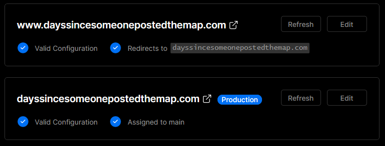

*Question: A customer writes in to our GitHub community stating "I have a custom domain which I purchased at GoDaddy and I want to use it on my project". In a couple of paragraphs, how do you respond?*

Response:

Hey there [person], hope you're having a wonderful day!

To add a domain from GoDaddy to your project, navigate to your project; the page's URL should look like this: `https://vercel.com/piemadd/dayssincesomeonepostedthemap`.

After doing so, press the `View Domains` button on the right side of the screen most of the way up, bringing you to your project's domain management screen.

At the top of this screen, you will see an empty textbox and an 'Add' button. Type your domain in this box and press the button. This will bring up a prompt on how you would like to add the domain. The recommended option is the top option, which will add your project to `www.[domain].com` and redirect `[domain].com` to your project, but for this example, I will use the second option, which will add a project to `[domain].com` and redirect `www.[domain].com` to it.

  

After doing so, you'll see one or two domain entries added to your project, depending on which selection you chose previously. For this example, I will need to set two domain records, one being an `A` record and the other being a `CNAME` record.

Starting, this is what the entry for an `A` record looks like on the domain management page, along with the settings that need to be set with your domain registrar, GoDaddy. They have their instructions for this step [here on their website](https://www.godaddy.com/help/add-an-a-record-19238) to set these settings; make sure to pay attention that the `Type`, `Name`, and `Value` are all correct.

The process for the `CNAME` record is pretty similar, which Godaddy has instructions for [here](https://www.godaddy.com/help/add-a-cname-record-19236).

After setting these, you can navigate back to your project's domain management page which should let you know that everything is configured properly, like this:

  
  
I hope this answers your question correctly and that you have a great rest of your day!

  
Sincerely,  
Piero Maddaleni

Note: [dayssincesomeonepostedthemap.com](https://dayssincesomeonepostedthemap.com) refers to a website to show how long it has been since someone posted the map:

